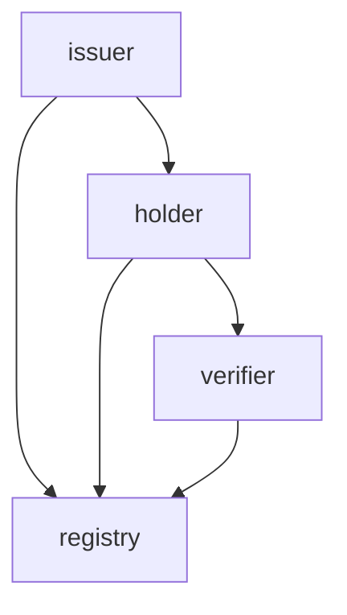

# The missing piece of the architecture: local trust resolver

* Author: Leif Johansson <leifj@siros.org>

## Introduction

In the 3rd party architecture issuers issue verfiable digital credentials to credential managers (aka wallets) that use them to present proofs of claims to verifiers. At several points in this flow, the participating actors need to trust signatures and other cryptographic material included in the protocol flows. Over the years several mechanisms have been proposed to resolve this trust on a protocol level. This note describes a different "take" on trust resolution.

## What is technical trust

The term "trust" is often used to describe willingness by a subject to engage in valuable transactions with another subject. Technical trust is used to describe the technical underpinnings (cryptography, cybersecurity, certificates etc) that are used to ensure that trust in a technical system isn't misplaced, in other words that the choice by a subject to trust another subject in the context of a technical system won't lead to adverse consequences for the subject.

One aspect of technical trust involves trust in digital signatures that rely on some form of asymmetric cryptography. By trusting a public key a subject chooses to accept signatures made with the corresponding private key as valid. In order to achive basic scalability it is common for public keys to be associated with a name (and possibly other metadata) and trusting a public key then becomes the act of choosing to accept that the public key is correctly associated with the provided name and metadata. This is often called name-to-key binding.

An X.509 certificate is a simple example of such name-to-key binding: the SubjectDN of the certificate is bound to the public key of the certificate by means of a digital signature made by another X.509 certificate. Choosing to trust a signature made by a public key in this case means chasing the signatures up to a previously agreed (set of) trust anchors. A certificate with at least one valid path of X509 certificates known to the Subject is deemed to be valid.

This note describes a general model for distributed trust architecture for namme to key binding that covers this case and several other cases that have been proposed recently for use by 3rd party identity systems.

## Trust resolution

